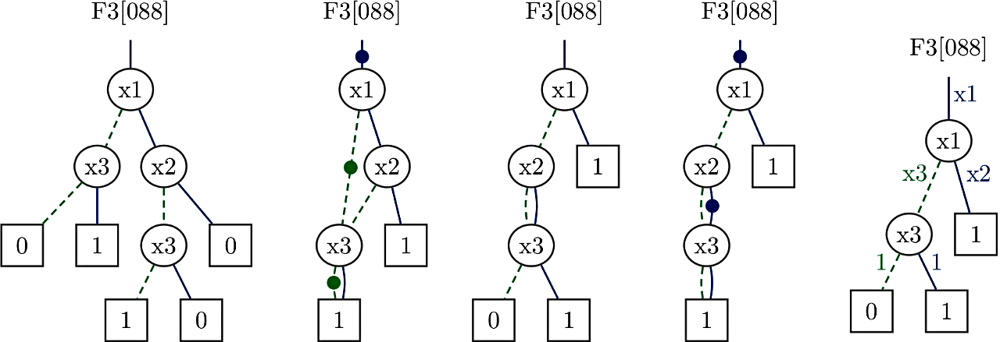
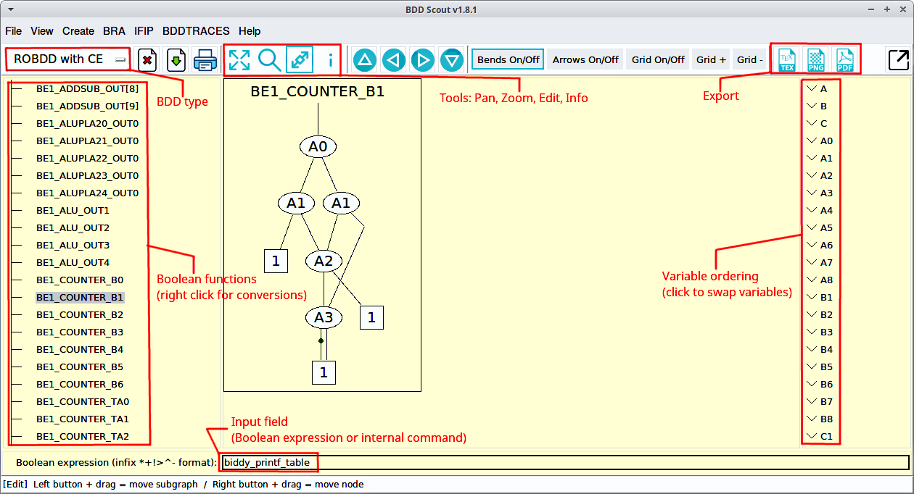

# Summary

A Binary Decision Diagram (BDD) is a data structure used in various applications
including but not limited to the design, testing, optimization, and verification
of digital circuits, communication protocols, and distributed systems
[@Bryant1986] [@Knuth2009] [@Minato2013]. There exist many different types of
BDDs intended for different applications. The most notable types are used to
represent Boolean functions and combination sets. For these purposes, BDDs can
be very efficient, for example, they enable the representation and manipulation
of sets of sparse cubes with 10^20 and more cubes [@Meolic2018].

An efficient implementation of algorithms for BDDs is a rather complicated task,
but several free BDD packages are accessible to the interested users.
The cross-platform Biddy BDD package [@Biddy] is one of them. In fact, it is
one of the oldest ones, with development going back to 1992 [@Meolic2012]. After
the period of a rather slow progress, it has substantially changed throughout
the last few years and became very competitive. Version 1.8.2 implements many
standard functionalities, such as automatic garbage collection, complemented
edges, and a manager. Dynamic variable ordering with a sifting algorithm and an
exhaustive search over all the possible variable orderings are provided, too.
Various statistics about global properties and the individual Boolean functions
are available. Furthermore, the most distinguishing properties of Biddy are a
refined C API and a uniform support for classical reduced ordered BDDs (ROBDDs)
and zero-suppressed BDDs (0-sup-BDDs). At this moment, Biddy is the only
package thoroughly supporting the tagged zero-suppressed BDDs
[@Meolic2016] [@Meolic2017].
Examples of BDDs of all the supported types are shown in Figure 1.

Figure 1: Representation of Boolean function
F3[088] = (NOT x1) AND x3 OR x1 AND (NOT x2) AND (NOT x3).
From left to right there are an ROBDD, an ROBDD with complemented edges,
a 0-sup-BDD, a 0-sup-BDD with complemented edges, and a tagged 0-sup-BDD.

In BDD, every internal node contains a variable while leafs include
constants 0 and 1, respectively. For an ROBDD, each edge
to internal node n with variable var(n), left successor else(n), and right
successor then(n) corresponds to the Boolean function that is calculated as
NOT(var(n)) AND else(n) OR var(n) AND then(n).
For ROBDD in Figure 1 this is applied as:
F3[088] =
(NOT x1) AND (NOT(x3) AND 0 OR x3 AND 1) OR
x1 AND (NOT(x2) AND (NOT(x3) AND 1 OR x3 AND 0) OR x2 AND 0).
The same result can be obtained if every path starting in the root and
leading to a leaf with constant 1 is considered to be a product of variables in
which a negative literal is included if the path continues in the else successor
and a positive literal is included if the path continues in the then successor.
The resulting Boolean function is a sum of the obtained products. In this
way, for the ROBDD in Figure 1 we obtain a minimal form
F3[088] = (NOT x1) AND x3 OR x1 AND (NOT x2) AND (NOT x3),
but in general, the result is not a minimal form. For the explanation of other
types of BDDs we refer readers to the given references.

The Biddy package is a part of the Biddy project that also focuses on
the visualization of BDDs. The application BDD Scout, which is bundled with the
Biddy package, is an interactive tool (Figure 2).
Its exciting features include the creation of a BDD from a
Boolean expression, node manipulation and variable reordering in the displayed
BDD, the conversion between the supported types of BDDs, and export to Latex
format. As a bonus, scripting with Tcl language is integrated. These features
make BDD Scout a unique tool for teaching and exploring properties of
BDDs [@BddEncyclopedia].

Figure 2: An annotated screenshot from BDD Scout

Similar to other BDD packages, the Biddy package itself is a kind of a low-level
mathematical library that can be extremely powerful but also wicked if not used
correctly. Because of this we coined a slogan for it,
"An old witch on the block",
which is supposed to be the underlying theme for all its design aspects in the
future. After all, software engineering is about the product appearance as well.

In conclusion, Biddy is free software to be used in applications that need to
manipulate Boolean functions or combination sets. In its current version, it is
a complete and efficient product suitable for many academic and commercial
settings. The Biddy's binary packages, user manual, and other documentation can
be obtained from http://biddy.meolic.com/.

# References
