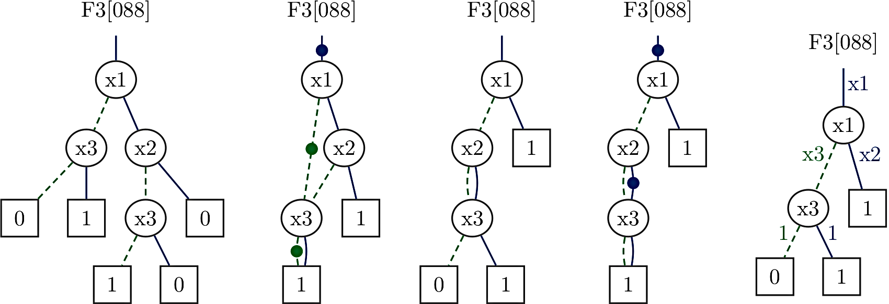

# Summary

A **Binary Decision Diagram** (BDD) is a data structure used in
different areas including but not limited to the design, testing,
optimization, and verification
of digital circuits, communications protocols, and distributed systems
[@Bryant1986]. There exist many different types of
BDDs intended for different applications. The most notable types are used to
represent Boolean functions and combination sets. For these purposes, BDDs can
be very efficient, for example, they enable the representation and manipulation
of set of sparse cubes with $10^{47}$ cubes [@Minato2013].

In a BDD, every internal node contains a variable while leafs contain
constants $0$ and $1$, respectively. For a 	Reduced Ordered Binary Decision Diagram (ROBDD), each edge to internal node $n$ with variable $var(n)$, left successor $else(n)$, and right successor $then(n)$ corresponds to the Boolean function $f(n)$ that is calculated as:

$$f(n) = \overline{var(n)}\ \&\ else(n) + var(n)\ \&\ then(n)$$

For the ROBDD in Figure 1 this is applied as follows:
$F3[088] = \overline{x1}\ \&\ (\overline{x3}\ \&\ 0 + x3\ \&\ 1) + x1\ \&\ (\overline{x2}\ \&\ (\overline{x3}\ \&\ 1\ + x3\ \&\ 0)\ + x2\ \&\ 0)$.
The same result can be obtained if every path starting in the root and
leading to a leaf with constant $1$ is considered to be a product of variables in
which a negative literal is included if the path continues in the else successor
and a positive literal is included if the path continues in the then successor.
The resulting Boolean function is a sum of the obtained products. In this
way, for the ROBDD in Figure 1 we directly obtain a minimal sum-of-products form,
but in general, the result is not a minimal form. For the explanation of other
types of BDDs we refer to the given references.

Figure 1: Representation of Boolean function
$F3[088] = \overline{x1}\ \&\ x3\ + x1\ \&\ \overline{x2}\ \&\ \overline{x3}$
with different types of BDDs.
From left to right there are an ROBDD, an ROBDD with complemented edges,
a 0-sup-BDD, a 0-sup-BDD with complemented edges, and a tagged 0-sup-BDD.

Boolean functions are primarily used in digital circuit design where
 $1000$ or more variables are not unusual. It is impossible
to represent such large Boolean functions with vectors and similar explicit
representations of the truth table. Strings are also not an option because
they are not canonical. On the other hand, many huge Boolean
functions of practical importance have a managable representation with BDDs.
Nowadays, however, logic synthesis is not the only, or even not the main, application area for
Boolean functions and BDDs. They are also used as characteristic
functions of sets and relations, which enables the encoding of
combinatorial problems and their symbolic solution [@Knuth2009] [@Minato2013] [@Meolic2018].
A very special method that has profited a lot from BDDs is model checking
[@Chaki2018].

An efficient implementation of algorithms for BDDs is a rather complicated task,
but several free BDD packages are avaliable online.
Herein we describe the cross-platform **Biddy BDD package** [@Meolic2012], one of the oldest continually developed of these BDD packages.
From version 1.8.2, many standard features are implemented, such as automatic
garbage collection, complemented edges, and a management system. Dynamic variable ordering
with a sifting algorithm and an exhaustive search over all the possible
variable orderings are provided, too.
Various statistics about global properties and the individual Boolean functions
are available. Furthermore, some distinguishing properties of Biddy are:

- Can be built on various platforms using native environments,
  including **gcc**, **mingw**, and **Visual Studio**.
- It follows a strict implementation style and a refined **C** API.
- It offers a uniform support for classical **reduced ordered BDDs** (ROBDDs)
  and **zero-suppressed BDDs** (0-sup-BDDs). At this moment, Biddy is the only
  package thoroughly supporting the **tagged zero-suppressed BDDs**
  [@Meolic2016] [@Meolic2017].

The Biddy BDD package is a part of the Biddy project that also focuses on
the visualization of BDDs. The application **BDD Scout**, which is bundled with the
Biddy package, is an interactive tool (Figure 2).
Its key features are:

- the creation of a BDD from a Boolean expression,
- node manipulation and variable reordering in the displayed BDD,
- conversion between the supported types of BDDs,
- exports to LaTeX, and
- integrated Tcl scripting.

These features make BDD Scout a unique tool for teaching and exploring properties of BDDs. For an example, check the generated BDD Encyclopedia [@BddEncyclopedia].

Figure 2: An annotated screenshot from BDD Scout

In conclusion, the Biddy BDD package is free software to be used in projects
that need to manipulate Boolean functions or combination sets. It is
a complete and efficient product suitable for many academic and commercial
settings. The binary executables, the user manual, and the other documentation can
be obtained from Biddy's Homepage [@Biddy].

# Acknowledgements

The development of the Biddy BDD package and BDD Scout application so far
was supported by University of Maribor,
Faculty of Electrical Engineering and Computer Science.

# References
